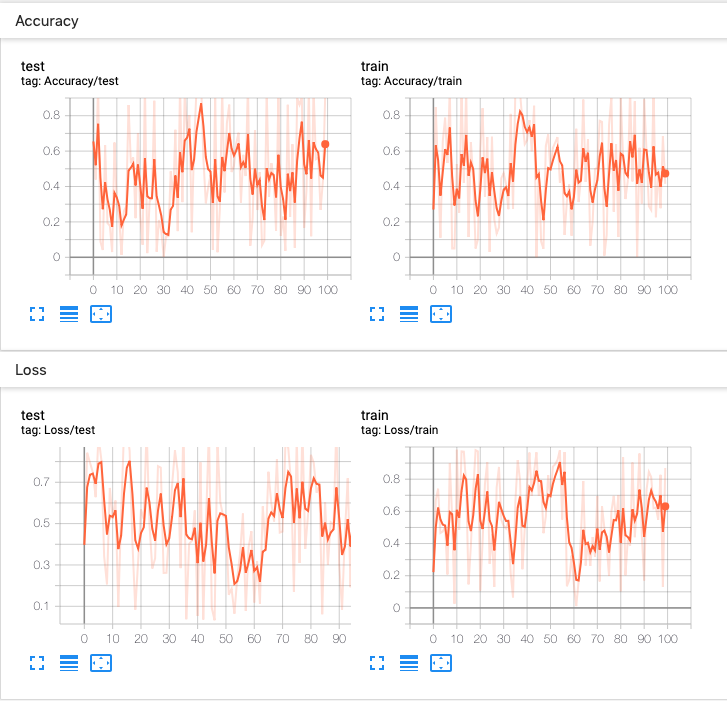
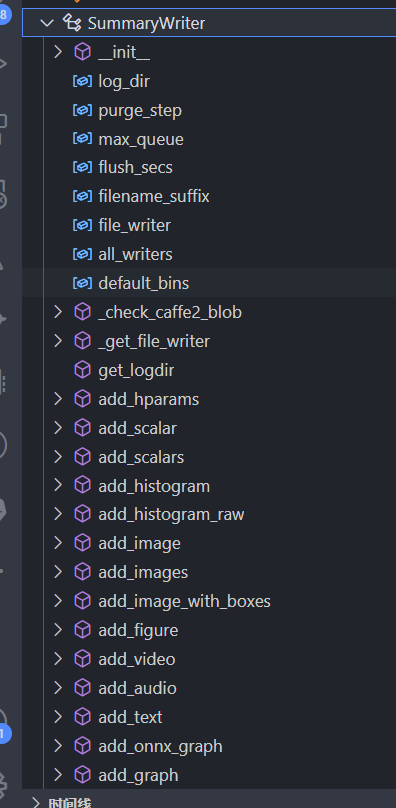

# 快速掌握 tensorboard

日期: 周日- 2023-02-26 20:58:01

作者: 范仁义

---

🍓

TODO:

---

1😍4💜10😈 复习记忆 🚩 重点 ⭐

---

🍎

🍓

🍊

🍒

🍌

🍑

🍧

# 一、tensorboard 作用

🍓

📒

TensorBoard 是 tensorflow 官方推出的可视化工具，它可以将模型训练过程中的各种汇总数据展示出来，包括标量(Scalars)、图片(Images)、音频(Audio)、计算图(Graphs)、数据分布(Distributions)、直方图(Histograms)和 Embeddigngs向量等。

🔧



🍍

🍉

# 二、tensorboard 安装

🍇

🍋

```
pip install tensorboard
```

🍅

或

```
pip install tensorflow
```

🍐

📖

🌱

🌺

🔥

# 三、tensorboard 最简单实例

✨

🍹

## 1、tensorboard 生成日志

```python
# 引入SummaryWriter
from torch.utils.tensorboard import SummaryWriter

# 将信息写入logs文件夹，可以供TensorBoard消费，来可视化
writer = SummaryWriter("logs")

# 绘制 y = 2x 实例
x = range(100)
for i in x:
    writer.add_scalar('y=2x', i * 2, i)

# 关闭
writer.close()
```

🧊

🍄

## 2、tensorboard 消费日志

```
tensorboard --logdir=logs

logs 是我们生成日志指定的目录
```

🌷

💮

🌸

# 四、tensorboard 常见功能

🍁

🌳



🌲

这里列一下，详细的参数说明和例子请参考：
[https://pytorch.org/docs/stable/tensorboard.html#torch-utils-tensorboard](https://links.jianshu.com/go?to=https%3A%2F%2Fpytorch.org%2Fdocs%2Fstable%2Ftensorboard.html%23torch-utils-tensorboard)

- `add_scalar(tag, scalar_value, global_step=None, walltime=None)`：添加标量数据
- `add_scalars(main_tag, tag_scalar_dict, global_step=None, walltime=None)`：添加多个标量数据
- `add_histogram(tag, values, global_step=None, bins='tensorflow', walltime=None, max_bins=None)`：添加一个柱状图
- `add_image(tag, img_tensor, global_step=None, walltime=None, dataformats='CHW')`：添加一张图片
- `add_images(tag, img_tensor, global_step=None, walltime=None, dataformats='NCHW')`：添加多个图片
- `add_figure(tag, figure, global_step=None, close=True, walltime=None)`：渲染一个 `matplotlib`的图片然后添加到 TensorBoard
- `add_video(tag, vid_tensor, global_step=None, fps=4, walltime=None)`：添加视频
- `add_audio(tag, snd_tensor, global_step=None, sample_rate=44100, walltime=None)`：添加音频
- `add_text(tag, text_string, global_step=None, walltime=None)`：添加文本
- `add_graph(model, input_to_model=None, verbose=False)`：添加图像
- `add_embedding(mat, metadata=None, label_img=None, global_step=None, tag='default', metadata_header=None)`：添加嵌入式投影，一个很好的例子就是我们可以将高维数据映射到三维空间中进行直观地展示和可视化
- `add_pr_curve(tag, labels, predictions, global_step=None, num_thresholds=127, weights=None, walltime=None)`：添加 PR 曲线
- `add_custom_scalars(layout)`：添加用户定义的标量
- `add_mesh(tag, vertices, colors=None, faces=None, config_dict=None, global_step=None, walltime=None)`：添加 3D 模型
- `add_hparams(hparam_dict, metric_dict, hparam_domain_discrete=None, run_name=None)`：添加一些可以调节的超参数

🌴

🍎

```
参考


torch.utils.tensorboard — PyTorch 1.13 documentation
https://pytorch.org/docs/stable/tensorboard.html#torch-utils-tensorboard

详解在PyTorch中使用tensorboard – 月来客栈
https://www.ylkz.life/deeplearning/p10491220/

```

🍓

✨

🍹

🍄

🌷

💮

# 五、常用 tensorboard 使用实例

🍊

🍒

🍌

🍑

🍍

## 1、可视化训练情况

🍉

🍇

🍋

🍅

🍐

📖

## 2、可视化训练的图片

🍧

🍓

📒

🔧

🌱

🌺

🔥

## 3、可视化训练的模型

✨

🍹

🧊

🍄

🌷

💮

🌸

🍁

🌳

🌲

🌴
